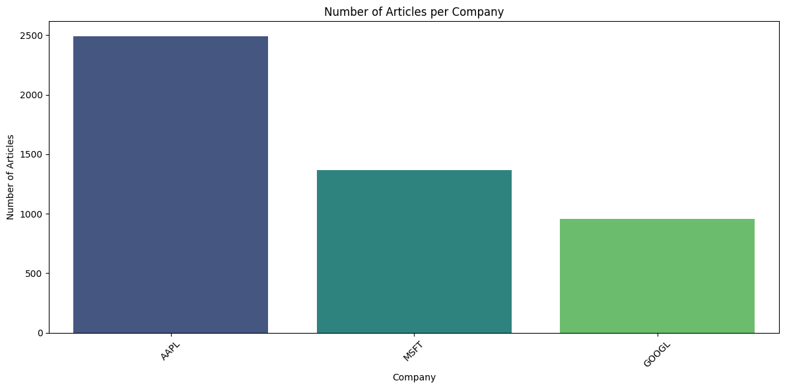
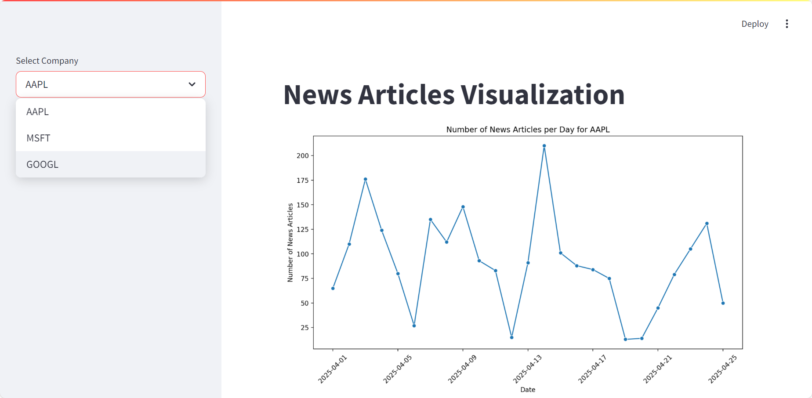

# Part 3 - Option A: LLM-Driven Visualization

## 1. Model and Platform Overview

- This part leverages the **OpenAI API** as the primary LLM service provider.
- The model invocation process, including all prompt designs and output generations, is organized in the `LLM-driven Summary.ipynb` notebook.

---

## 2. First Visualization - Histogram

- **Prompt Logic**:
  - A prompt was designed to instruct the model to analyze `company.json`, count the number of news articles for each company, and generate a histogram.
  - The focus was on guiding the model to group data by the `company` field, aggregate the counts, and produce corresponding visualization code.

- **Generation and Results**:
  - The generated Python code was executed directly within the notebook, successfully producing a histogram showing the distribution of news articles among Apple, Microsoft, and Google.
  - The chart clearly illustrates the relative number of earnings-related articles for each company.

---

## 3. Second Visualization - Streamlit Dashboard

- **Prompt Logic**:
  - A prompt was designed to guide the model in creating an interactive visualization dashboard to display the trend of news articles over time for each company.
  - The model was instructed to output full Streamlit application code, including a company selector, date filtering logic, daily article counts, and line chart generation.

- **Generation and Implementation**:
  - The model successfully generated a functional Streamlit app, and the code is saved in `generated_streamlit_code.txt`.
  - This code was further executed to deploy an interactive dashboard.

- **Dashboard Features**:
  - **Left Panel**: A company selector allowing users to choose among Apple, Microsoft, and Google.
  - **Right Panel**: A dynamic line chart showing the number of news articles per day for the selected company.
  - The line chart automatically updates based on the selected company, reflecting the news volume trends over time.

---
